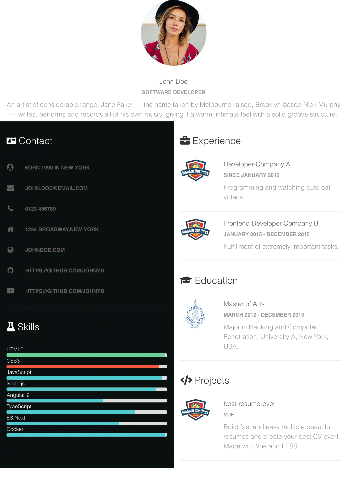

<h1 align="center">
   
  
   
  best-resume-ever
   
</h1>

<h4 align="center">
  :necktie: :briefcase: Build fast :rocket: and easy multiple beautiful resumes and create your best CV ever!
    
  Made with Vue.
</h4>

 
 

 
 

## How to use

best-resume-ever requires at least node v.7.4.

1. Clone this repository.

2. Run `npm install`.

3. Edit your personal data in `src/person.js`.

4. Preview resumes with `npm run dev`.

5. Export with `npm run export`.

All resumes will be exported to `/pdf`.

 

## Creating and Updating Templates

Please read the <a href="DEVELOPER.md">developer docs</a> on how to create or update templates.

 

## Contribute

Feel free to add your own templates, fix bugs or improve the docs. Any kind of help is appreciated! If you any kind of changes to an existing template, please commit them as new templates.

 

## Credits

This project uses several open source packages:

* <a href="https://github.com/vuejs/vue" target="_blank">Vue</a>
* <a href="https://github.com/twbs/bootstrap" target="_blank">Bootstrap</a>
* <a href="https://github.com/mixu/electroshot" target="_blank">Electroshot</a>

This project inspired from These projects:
* <a href="https://github.com/cristijora/best-resume-ever" target="_blank">cristijora's best-resume-ever</a>
* <a href="https://github.com/salomonelli/best-resume-ever" target="_blank">cristijora's best-resume-ever</a>

This project takes design form:
* <a href="https://github.com/creativetimofficial/paper-kit-2" target="_blank">paper-kit-2 by creativetimofficial</a>
